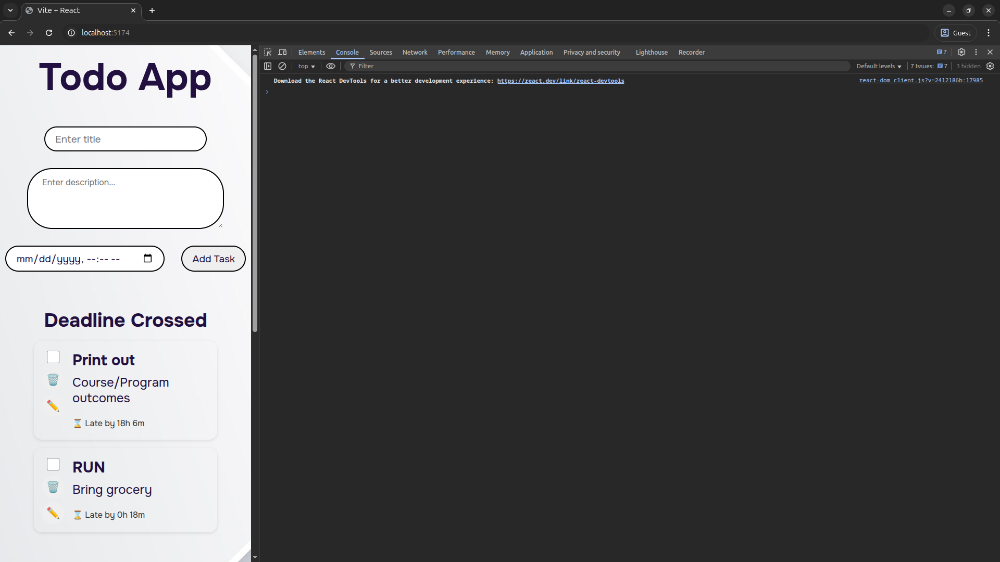
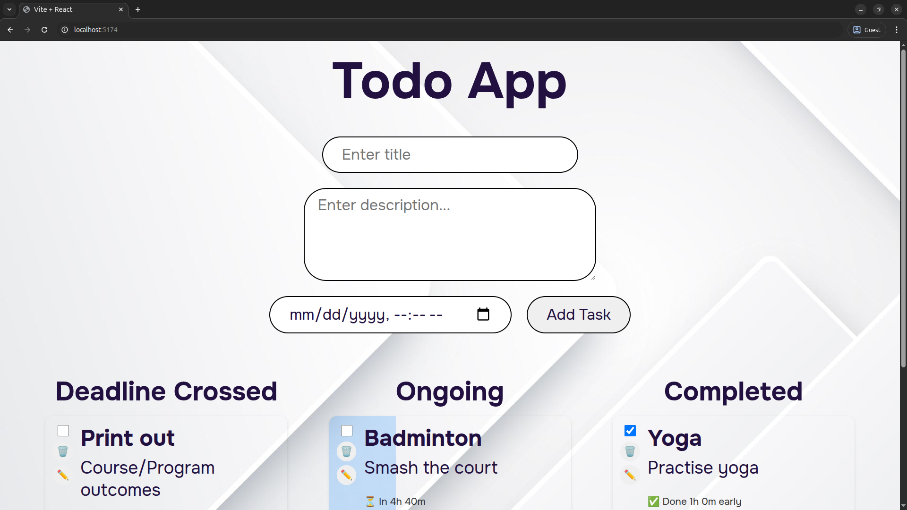

# 📝 Todo App

A dynamic task management app built utilizing **React.js**, featuring:

- Real-time deadline tracking ⏰
- Automatic transition between **Ongoing**, **Deadline Crossed**, and **Completed**
- Task editing, deleting, and marking as done ✅

---

## 📸 Features

- ✍️ **Add Tasks** with title, description, and deadline
- 🕒 **Live status transition** based on deadline
- 🔁 **Edit Tasks** inline
- ✅ **Toggle completion status**
- 🗑️ **Remove Tasks**
- 📆 Deadline-based categories:
  - **Ongoing**: Tasks not yet due
  - **Deadline Crossed**: Tasks that missed the deadline and are not completed
  - **Completed**: Tasks marked as done (with info on whether early or late)

## 🧠 Tech Stack

- Frontend: React (with functional components + hooks)
- State Management: React useState, useEffect
- Time Handling: Native JS Date, setInterval
- Styling: CSS3 with responsive design, glassmorphism elements

## Screenshots

## Available Scripts

- **Clone this repository and run the scripts**
- `npm run dev` - Start development server
- `npm run build` - Build for production
- `npm run preview` - Preview production build
- `npm run lint` - Run ESLint

## Acknowledgments

- [CSS-Tricks Flexbox Guide](https://css-tricks.com/snippets/css/a-guide-to-flexbox/) by Chris Coyier - Essential resource for layout design
- [Vite](https://vitejs.dev/) - For providing an excellent development experience
- [React](https://reactjs.org/) - For the amazing Javascript library
- A.I Tools (Windsurf, ChatGPT)
